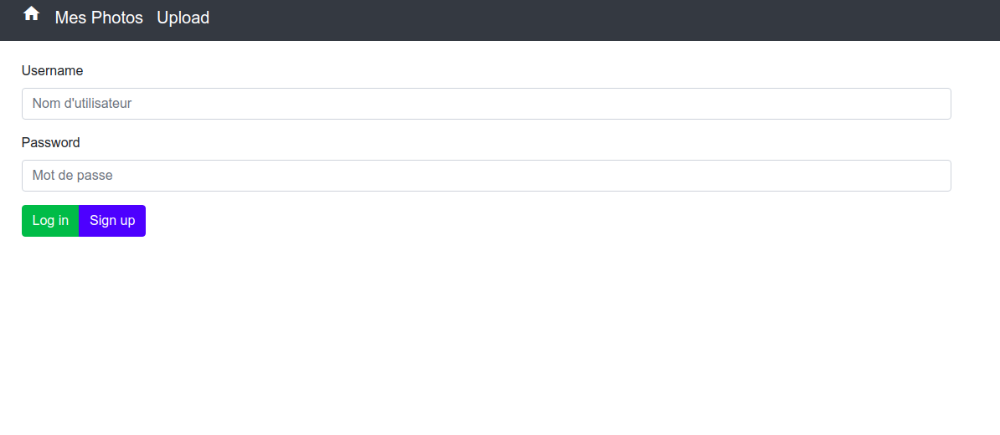
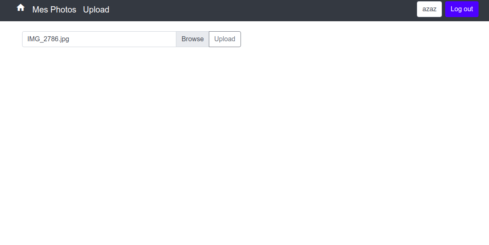
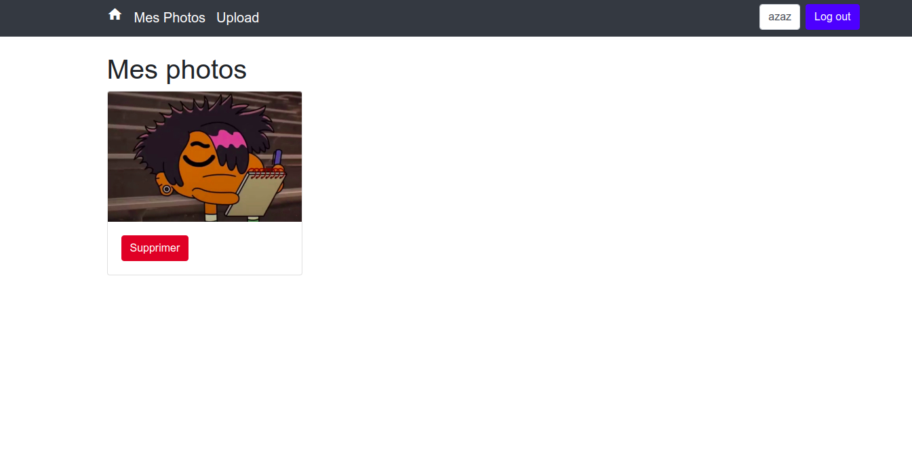
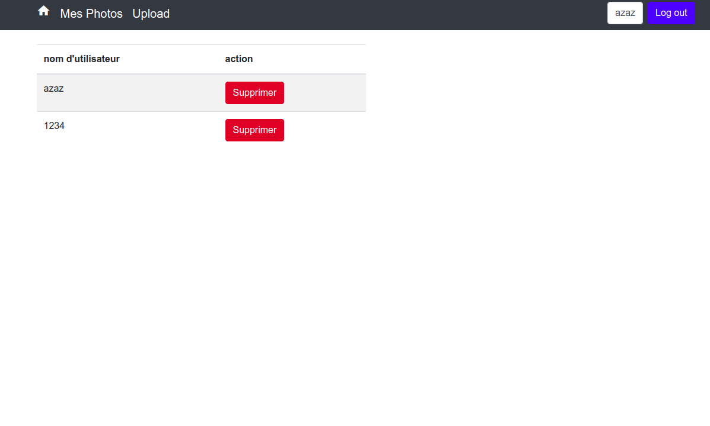

# Hostpic
A website for pictures hosting, and more.

## TL;DR

If you don't want to install all the project take a look here I'll describe what I've learned, which stack I've used etc...

Stack used 
    
    BackEnd : NodeJs(with ExpressJs) And MongoDB
    FrontEnd : PugJS, Bootstrap, jQuery
    
The whole BackEnd is write in TypeScript and the FrontEnd is PugJs (ex Jade) template

So what I've learned ? (this is not an exhaustive list I assume I've learned more than that)
* Structure a website by using MVC design
* Manage a database with MongoDB
* Manage a server with ExpressJs
* Async / Await and Promises and the difference between a thread(e.g. Java) and a promise
* Security but briefly I don't use helmet and other stuff for now 
* How cookies and sessions work
* Upload with multerJS
* Errors Handling
* AJAX Request
* (TypeScript, JavaScript,npm ,NodeJs, Git and GitHub) obviously 
* Etc ...

### 1. Install dependencies
```
npm install
```

### 2. Download mongodb database (https://www.mongodb.com/download-center/community) 
    version 4.0.14 
    OS Linux 64-bit legacy x64
    package TGZ
    
### 3. Create needed folders (a script will be available soon)
```shell script    
# inside the root projet folder  
sh create_folders.sh
# unzip the downloaded server here
```
    
### 4. launch the database and the server
```shell script
# Build the project
npm build 

# Move to server bin folder
cd "/mongoDB/[SERVER_FOLDER_NAME]/bin"

# Run the server
./mongod --dbpath="`pwd`/mongoDB/data"

# In another terminal inside root project folder
npm start
```

#### Some screenshots

##### login


##### upload 


##### my pictures


##### administration
 